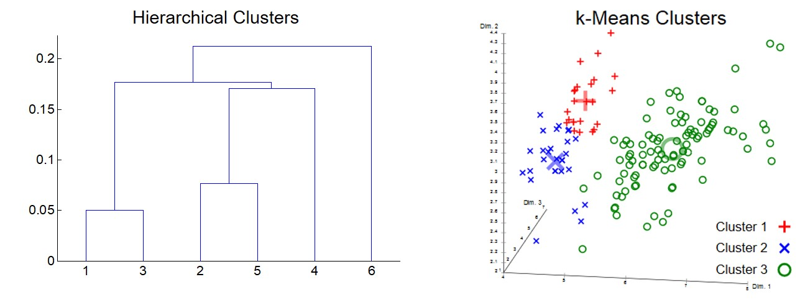
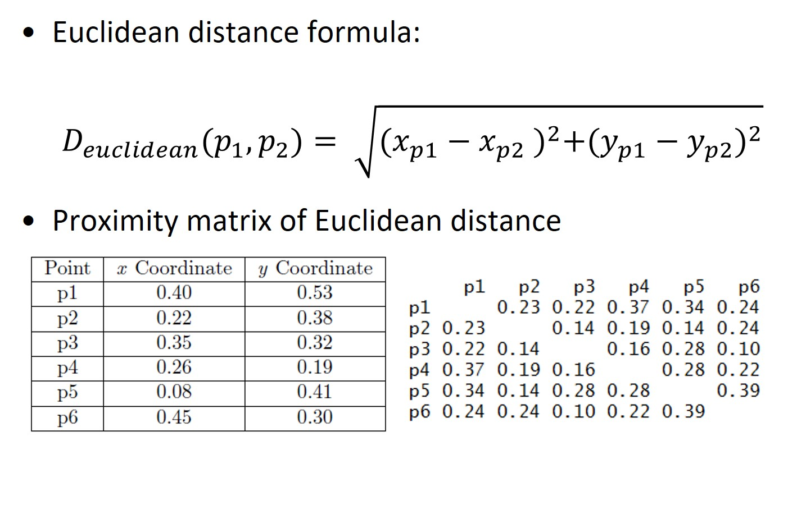
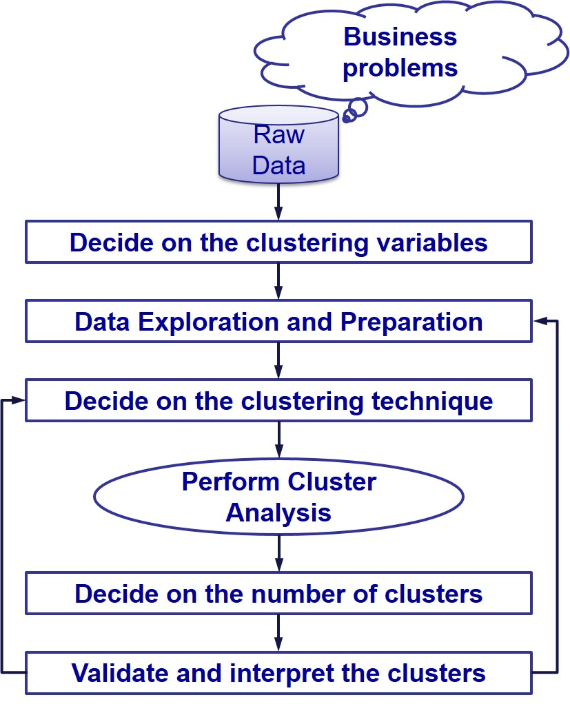
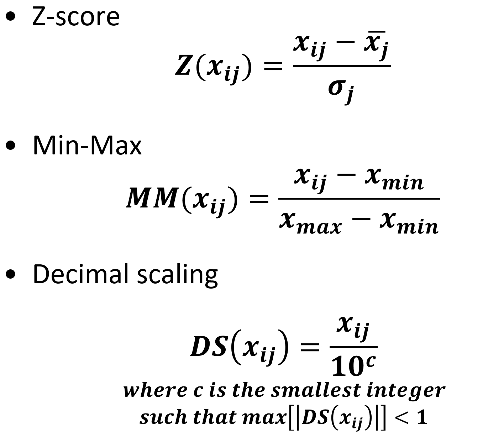
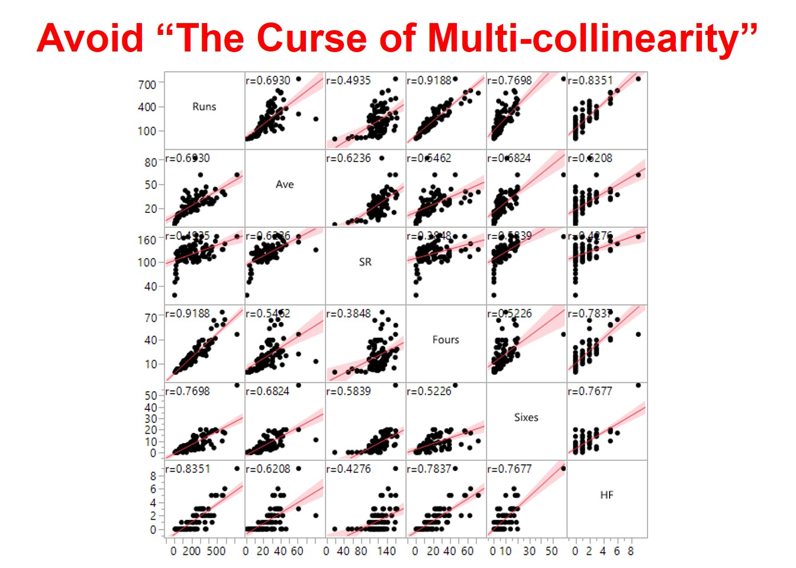
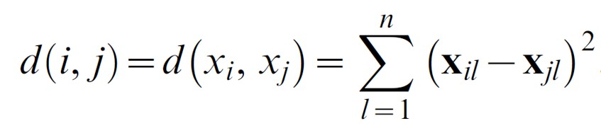
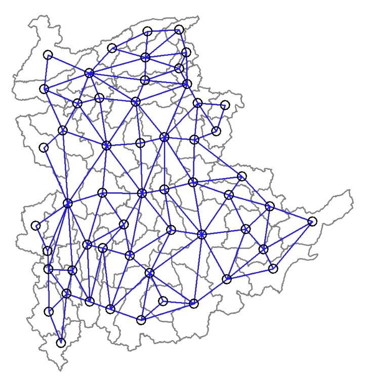

```{r setup, include=FALSE}
knitr::opts_chunk$set(echo = FALSE, fig.retina = 3, warning = FALSE, message = FALSE)
```

```{r xaringan-themer, include=FALSE, warning=FALSE}
library(xaringanthemer)
style_duo_accent(
  primary_color = "#1381B0", 
  secondary_color = "#FF961C",
  inverse_header_color = "#FFFFFF")
```


# Content
.large[
- What is Geographic Segmentation?

- Introducing Cluster Analysis

- Hierarchical Class Analysis

- Cluster Analysis Process

- Spatially Constrained Clustering Techniques
]

---
## What is Geographical Segmentation?

.pull-left[
.large[
- Geographic segmentation divides a target market by location so marketers can better serve customers in a particular area. 

- This type of market segmentation is based on the geographic units themselves (countries, states, cities, etc.), but also on various geographic factors, such as climate, cultural preferences, populations, and more.]

.small[For business applications of geographic segmentation, refer to https://manychat.com/blog/geographic-segmentation/]
]

.pull-right[
]

---
## Advantages of Geographic Segmentation

.large[
- It's an effective approach for companies with large national or international markets because different consumers in different regions have different needs, wants, and cultural characteristics that can be specifically targeted.

- It can also be an effective approach for small businesses with limited budgets. They can focus on their defined area and not expend needless marketing dollars on approaches ill-suited for their target geographic segment.

- It works well in different areas of population density. Consumers in an urban environment often have different needs and wants than people in suburban and rural environments. There are even cultural differences between these three areas. 
]

---
## Cluster Analysis

.pull-left[
- **Cluster analysis** or **Clustering** is the task of grouping a set of an object in such a way object in the same group(called cluster) are more similar( in some sense or another to each other than to those in another group (clusters). 

- In modern machine learning age, it is belong to the family of exploratory data mining.

- It has been used in many fields including Machine Learning, Pattern Recognition, Image Analysis, Information Retrieval, Bioinformatics, Data Compression, and Computer Graphics. 
]

.pull-right[
]

---
## Typology of Cluster Analysis Techniques

.pull-left[
- Hierarchical clustering
    - A set of nested clusters organized as a hierarchical tree.]

.pull-right[
- Partitioning clustering (also known as k-means)
    - A division data objects into non-overlapping subsets (clusters) such that each data object is in exactly one subset.]

.center[
]

---
# Hierarchical Clustering
.large[
- Produces a set of nested clusters organized as a hierarchical tree.] 

.center[
]

---
## Hierarchical Methods

.pull-left[
- Agglomerative clustering: It’s also known as **AGNES (Agglomerative Nesting)**. It works in a bottom-up manner. That is, each object is initially considered as a single-element cluster (leaf). At each step of the algorithm, the two clusters that are the most similar are combined into a new bigger cluster (nodes). This procedure is iterated until all points are member of just one single big cluster (root). The result is a tree which can be plotted as a dendrogram.
- Divisive hierarchical clustering: It’s also known as **DIANA (Divise Analysis)** and it works in a top-down manner. The algorithm is an inverse order of AGNES. It begins with the root, in which all objects are included in a single cluster. At each step of iteration, the most heterogeneous cluster is divided into two. The process is iterated until all objects are in their own cluster.
]

.pull-right[
]

---
## Basic Agglomerative Hierarchical Clustering Algorithm


---
## What is Proximity Matrix?

.large[
- Measures of Similarity or Dissimilarity.
]
.center[
]

---
## Three commonly used methods to calculate proximity matrix

.center[
]

---
### Proximity matrix: Euclidean distance



---
### Proximity matrix: City-block distance


---
### Proximity matrix: Chebychev distance


---
## Agglomerative Hierarchical Clustering Algorithms

The most common types methods are:

- **Maximum** or **complete linkage** clustering: It computes all pairwise dissimilarities between the elements in cluster 1 and the elements in cluster 2, and considers the largest value (i.e., maximum value) of these dissimilarities as the distance between the two clusters. It tends to produce more compact clusters.

- **Minimum** or **single linkage** clustering: It computes all pairwise dissimilarities between the elements in cluster 1 and the elements in cluster 2, and considers the smallest of these dissimilarities as a linkage criterion. It tends to produce long, “loose” clusters.

- **Mean** or **average linkage** clustering: It computes all pairwise dissimilarities between the elements in cluster 1 and the elements in cluster 2, and considers the average of these dissimilarities as the distance between the two clusters.

- **Centroid** linkage clustering: It computes the dissimilarity between the centroid for cluster 1 (a mean vector of length p variables) and the centroid for cluster 2.

- **Ward’s minimum variance** method: It minimizes the total within-cluster variance. At each step the pair of clusters with minimum between-cluster distance are merged.

---
### Agglomerative Hierarchical Clustering Algorithms - Dendrograms

.center[
]

---
# Cluster Analysis Process

.center[
]

---
## Data Preparation

.pull-left[
.large[
To perform a cluster analysis in R, generally, the data should be prepared as follows:
- Rows are observations (individuals) and columns are variables.
- Input variables must be inline with the segmentation task.
- Ideally, the input variables must be in continuous data type. 
- Any missing value in the data must be removed or estimated.]]

.pull-right[
]

---
## Univariate EDA

.large[
Checking the distribution of the cluster variables,
- if their data ranges diferences are very large.] 

.center[
]

---
### Variable standardisation techniques



---
## Bivariate EDA

.large[
Checking if the input variables are highly correlated (i.e. correlation coefficient >=0.85).]

.center[
]

---
## Visual interpretation of hierarchical clusters: Dendrogram

.center[
]

---
## Visual interpretation of hierarchical clusters: 
### Dendrogram with heatmap

.center[
]

---
## Limitation of non-spatial clustering algorithm

.large[
- Spatially fragmented regions.]

.center[
]

---
# Spatially Constrained Clustering Methods

.large[
- Grouping contiguous objects that are similar into new aggregate areal units
    - tension between attribute similarity.

- Grouping of similar observations
    - locational similarity: group spatially contiguous observations only.]
    
---
## Introducing SKATER method

.large[
- Spatial Kluster analysis by Tree Edge Removal Assuncao et al (2006) algorithm.

- Construct minimum spanning tree from adjacency graph.

- Prune the tree (cut edges) to achieve maximum internal homogeneity.
]

.small[Reference: AssunÇão, R. M ; Neves, M. C ; Câmara, G ; Da Costa Freitas, C (2006) "Efficient regionalization techniques for socio-economic geographical units using minimum spanning trees", *International Journal of Geographical Information Science*, Vol.20 (7), p.797-811 (https://web-a-ebscohost-com.libproxy.smu.edu.sg/ehost/detail/detail?vid=0&sid=60b437ef-2130-43e1-808f-e1933ac625a8%40sdc-v-sessmgr03&bdata=JnNpdGU9ZWhvc3QtbGl2ZSZzY29wZT1zaXRl#db=asn&AN=21895448)]

---
## Contiguity as a Graph

.pull-left[
.large[
- Network connectivity based on adjacency between nodes (locations).

- Edge value reflects dissimilarity between nodes.



- Objective is to minimize within-group dissimilarity (maximize between-group).
]]

.pull-right[
]

---
## Minimum Spanning Tree Algorithm (Assuncao et al 2006)

.pull-left[
.large[
- Connectivity graph G = (V, L), V vertices (nodes), L edges path
    - a sequence of nodes connected by edges v1 to vk: (v1,v2), …, (vk-1,vk).
- Spanning tree 
    - tree with n nodes of G unique path connecting any two nodes n-1 edges.
- Minimum spanning tree
    - spanning tree that minimizes a cost function minimize sum of dissimilarities over all nodes.]]

.pull-right[
]

---
## SKATER - A heuristic for fast tree partitioning

.pull-left[
]

.pull-right[
]

---
## Spatially Constrained Clustering using SKATER

.pull-left[
]

.pull-right[
]


```{r echo=FALSE, eval=FALSE}
library(pagedown)
pagedown::chrome_print("Lesson08-GeoKDD.html")
```
