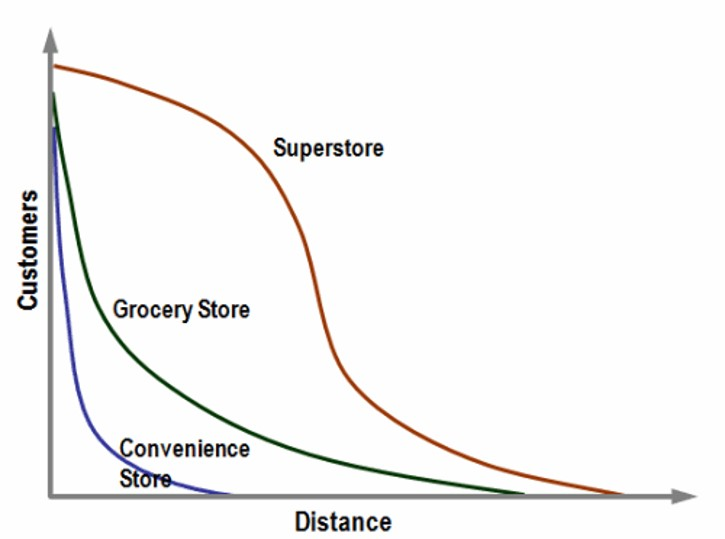
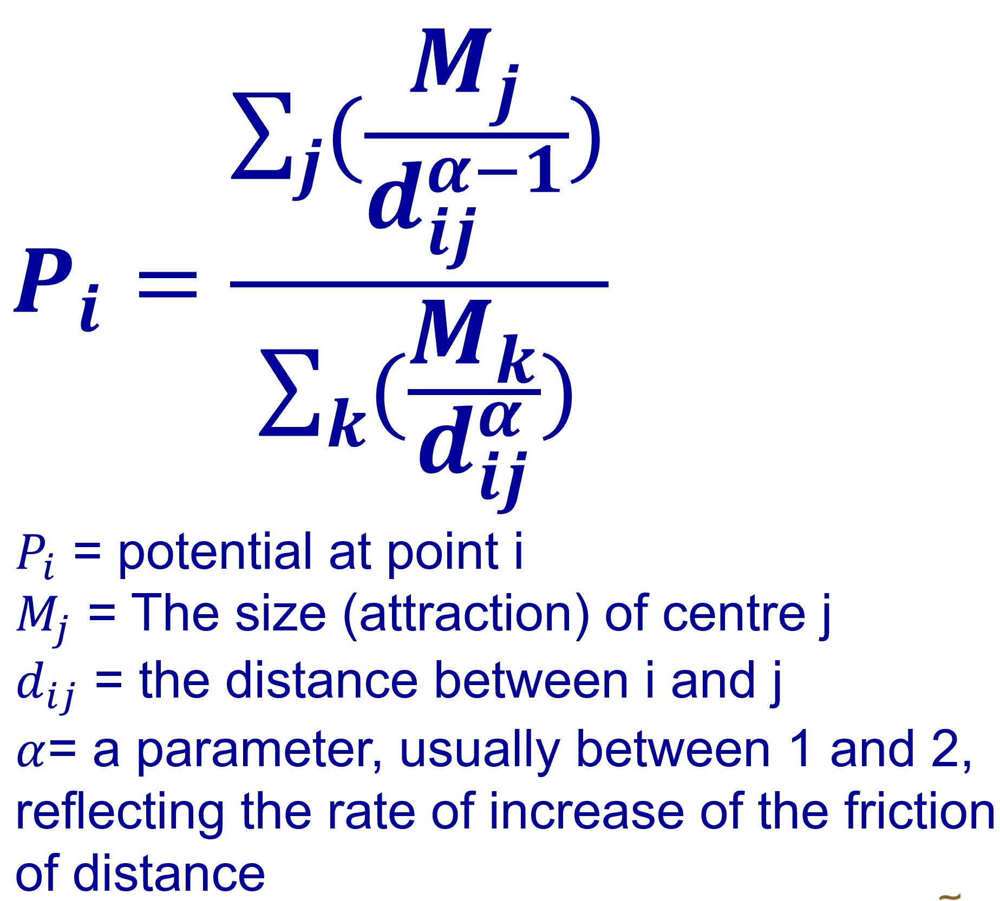
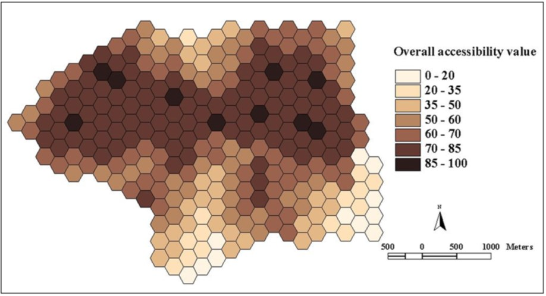

```{r setup, include=FALSE}
knitr::opts_chunk$set(echo = FALSE, fig.retina = 3, warning = FALSE, message = FALSE)
```

```{r xaringan-themer, include=FALSE, warning=FALSE}
library(xaringanthemer)
style_duo_accent(
  primary_color = "#1381B0",
  secondary_color = "#FF961C",
  inverse_header_color = "#FFFFFF"
)
```

# Content

.vlarge[
+ Basic Concepts of Geography of Accessibility
+ Accessibility Models
  + Stewart Potential model
  + Reilly model
  + Huff model

]

---
## What is Geography of Accessibility?

.vlarge[
+ Accessibility is the measure of **the capacity of a location to be reached from, or to be reached by, different locations**. Therefore, the capacity and the arrangement of transport infrastructure are key elements in the determination of accessibility.
]

---
## Why Model Geography of Accessibility?

.vlarge[
+ Questions that can be answered by accessibility models:
  + Which part of the geographical areas are deprived from getting access to a social service, facility or job opportunity?
  + Which part of the geographical areas will be affected by a public policy or business decision such as merging JCs, secondary and primary schools.
]

---
## Measuring Distances

.vlarge[
+ Different spatial and distance conceptualizations that are commonly employed when measuring and modelling accessibility.
]

.center[

]

---
### Distance Consideration

.large[Cartesian distance versus Network distance]

.center[

]

.small[
Reference: Philippe Apparicio et. al. (2017) ["The approaches to measuring the potential spatial access to urban health services revisited: distance types and aggregation‑error issues.](https://ij-healthgeographics.biomedcentral.com/articles/10.1186/s12942-017-0105-9) *International Journal of Health Geographics*, pp. 16:32]

---
### The distance friction
 
.pull-left[
.large[
+ Modeling spatial interactions implies quantifying the **distance friction** or **impedance**. 
+ The role of the distance can be interpreted as a disincentive to access desired destinations or opportunities (e.g. jobs, shops).]
]

.pull-right[

]


???
The perception of how far a destination is may not be a linear function of distance. People are more likely to shop at a place close to home than one far away. Distance is viewed as a nonlinear deterrent to movement. This phenomenon can be modeled by using a distance-decay function. The use of a power distance-decay function is borrowed from Newton's law of gravitation, from which the term gravity model is derived.  A distance-decay parameter, symbolized by the Greek letter beta, can be used to exaggerate the distance to destinations.  Some activities, such as grocery shopping, have a large exponent, indicating that people will travel only a short distance for such things.  Other activities, such as furniture shopping, have a small exponent, because people are willing to travel farther to shop for furniture.
 
---
### Distance Decay function.

.pull-left[
.large[Inverse distance decay, 𝜶∕𝒅_𝜷 


]]

.pull-right[
.large[Exponential distance decay, 𝜶𝒆^(−𝜷𝒅) 


]]

---
## The Geographical Unit

.vlarge[
+ This issue of irregularly shaped polygons created arbitrarily (such as county boundaries or block groups that have been created from a political process).
]

.center[

]

---
## The Geographical Unit

.vlarge[
+ Using regular shaped geometry such as square, hexagon or triangle to define geographical unit.]

.center[

]

???
In GIS analysis, regularly shaped grids is used for many reasons such as normalizing geography for mapping or to mitigate the issues of using irregularly shaped polygons created arbitrarily (such as county boundaries or block groups that have been created from a political process). Regularly shaped grids can only be comprised of equilateral triangles, squares, or hexagons, as these three polygon shapes are the only three that can tessellate (repeating the same shape over and over again, edge to edge, to cover an area without gaps or overlaps) to create an evenly spaced grid.

---
## The Geographical Unit

.large[
+ Hexagons reduce sampling bias due to edge effects of the grid shape, this is related to the low perimeter-to-area ratio of the shape of the hexagon. 
+ A circle has the lowest ratio but cannot tessellate to form a continuous grid. Hexagons are the most circular-shaped polygon that can tessellate to form an evenly spaced grid.]

.center[


]

???
Though the square (fishnet) grid is the predominantly used shape type in GIS analysis and thematic mapping, there are ways in which hexagons may be better suited for your analysis based on the nature of your question.

Hexagons reduce sampling bias due to edge effects of the grid shape, this is related to the low perimeter-to-area ratio of the shape of the hexagon. A circle has the lowest ratio but cannot tessellate to form a continuous grid. Hexagons are the most circular-shaped polygon that can tessellate to form an evenly spaced grid.

---
## The Geographical Unit

.large[
+ An example of 250m radius hexagons covering Singapore main island. 
]

.center[

]

---
## Distance to Nearest Location

.pull-left[
.vlarge[
The formula:]


]

--
.pull-right[
.vlarge[
Limitation of the method:]

.large[
+ Does  not  consider  the  size/attractiveness  of  the  closest  location,  thereby  implicitly  treating  all 
locations as being equally attractive. 
+ Does not consider the cumulative effect of multiple accessible locations (e.g. is a zone that is within 
1.1 km of two MRT stations inferior to one that is within 1.0 km of a single station?
]]


---
## The Potential Model
### The classic model

.center[

]

---
### The Modified Potential Formula

.center[

]


---
### Real world application of potential model

.large[
+ Accessibility to urban functions study
]

.center[

]

---
### Real world application of potential model

.pull-left[
.large[Accessibility to shopping centres
]


]

--
.pull-right[
.large[Accessibility to health services]


]

---
### Real world application of potential model

.large[
+ Overall accessibility
]

.center[

]

---
## Two-step floating catchment area method (2SFCA)

.pull-left[
.large[
+ A special case of a potential model for measuring spatial accessibility to primary social services and public facilities.
+ It was inspired by the spatial decomposition idea first proposed by Radke and Mu (2000).
]

.small[
Reference: Luo, W.; Wang, F. (2003b). ["Measures of spatial accessibility to health care in a GIS environment: synthesis and a case study in the Chicago region"](https://www.niu.edu/landform/papers/Luo_Wang2003.pdf). *Environment and Planning B: Planning and Design*. 30 (6): 865–884. 
]]

.pull-right[
.large[
An earlier version of 2SFCA
]

]

---
## Two-step floating catchment area method (2SFCA)

.pull-left[
.large[
**Step 1**: For each physician location *j*, search all population locations (*k*) that are within a threshold travel time (*d0*) from location *j* (that is, catchment area *j* ), and compute the physician-to-population ratio, *Rj*, within the catchment area:
]


]  
  
.pull-right[
.large[
An earlier version of 2SFCA
]

]  
 
---
## Two-step floating catchment area method (2SFCA)
  
.pull-left[
.large[
**Step 2:** For each population location *i*, search all physician locations (*j*) that are within the threshold travel time (*d0*) from location *i* (that is, catchment area *i*), and sum up the physician-to-population ratios, *Rj*, at these locations:
]


]

.pull-right[
.large[
An earlier version of 2SFCA
]

]  

---
## Enhanced Two-step Floating Catchment Area (E2SFCA) 

.pull-left[
**Step1:** The catchment of physician location *j* is defined as the area within 30-min driving zone(Lee, 1991). Within each catchment, compute three travel time zones with minute breaks of 0–10,10–20 and 20–30min(zones1–3,respectively). Search all population locations(*k*) that are within a threshold travel time zone (*Dr*) from location *j* (this is catchment area *j*), and compute the weighted physician-to-population ratio, *Rj*, within the catchment area as follows:


]

.pull-right[
**Step2:** For each population location *i*, search all physician locations (*j*) that are within the 30min travel time zone from location *i* (that is,catchment area *i*), and sum up the physician-to-population ratios (calculated in step1), *Rj*, at these locations as follows:


]

---
### Comparing 2SFCA and E2SFCA

.center[

]

.small[
Reference: Luo, Wei.,  Qi, Yi. (2009) ["An enhanced two-step floating catchment area (E2SFCA) method for measuring spatial accessibility to primary care physicians"](https://www.researchgate.net/publication/26646789_An_Enhanced_Two-Step_Floating_Catchment_Area_E2SFCA_Method_for_Measuring_Spatial_Accessibility_to_Primary_Care_Physicians), *Health & Place*, 2009, Vol.15 (4), p.1100-1107.
]

???
2SFCA method tends to over estimate accessibility because distance decay is not considered, and thus identifies smaller total shortage areas. The sharper distance decay weight (weight2) used in E2SFCA identifies greater total shortage area (in terms of both physical area and population) than as lower distance decay weight(weight1).The policy implication is that using the E2SFCA method would more explicitly identify and delineate HPSAs. This would help allocate the limited resources to the most needy places.


---
## Spatial Accessibility Measure (SAM)

.vlarge[
The formula:
]

.center[

]

.large[
where 

+ *Aai* is the accessibility in ED *i*, 
+ *nj* is the capacity of the target facility *j*. 
+ *pi* is the demand of this ED, and 
+ *dij* is the network distance between the *EDi* and each facility *j*.
]

.small[
Reference: Stamatis Kalogirou & Ronan Foley (2006) ["Health, place and Hanly: Modelling accessibility to hospitals in Ireland"](https://www.tandfonline.com/doi/abs/10.1080/00750770609555866), *Irish Geography*, Volume 39(1), 2006, 52-68.
]


```{r echo=FALSE, eval=FALSE}
library(pagedown)
pagedown::chrome_print("Lesson11.html")
```

