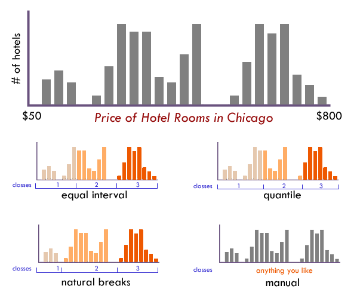
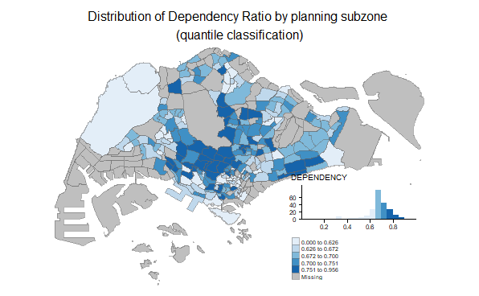

```{r setup, include=FALSE}
knitr::opts_chunk$set(fig.retina=3,
                      echo = FALSE,
                      eval = TRUE,
                      message = FALSE,
                      warning = FALSE)
```

## Content

.vlarge[
- Choropleth Mapping with in R
    - Type of choropleth map
    - Classification of maps
    - Colourscheme

- tmap Methods
    - tmap framewok

] 

---
## Choropleth Map

.large[
A choropleth map is a type of thematic map in which areas are shaded or patterned in proportion to a statistical variable that represents an aggregate summary of a geographic characteristic within each area, such as population or per-capita income.
]

.center[

]

---
### Classified choropleth map

- Choropleth maps can be either classified or unclassified.
- A classed choropleth map combines areal units into a smaller number of groups.  Interval levels may vary, but typically 4 to 7 are used in a map.  There is different classification techniques used to divide up the intervals.  

.center[
]

---
### Unclassified choropleth map

- Unclassed choropleth maps are similar to classed choropleth maps; however, unclassed choropleth maps do not have an averaged statistic towards each particular colour.  

.center[
]

---
### Choosing an appropriate number of classes

.center[
]

???
The more classes you use, the less data generalization (which is good), but this comes at the expense of legibility and the associated risk of map reading errors since more colors are harder to see and print reliably (which is bad). The key question is how much generalization do you want? A map with 3 classes/colors (e.g., low, medium, high) will be easy to see and remember, but may gloss over some very important aspects of the data and create artificial geographic patterns by lumping together many places that are in fact quite different. There is no ideal number of classes for a map, so experiment.

---
### Data classification

.center[

]


???
Not sure how many classes to use? Have a look at the distribution of your data in a histogram (see examples below): Are there obvious clusters within your data? Are there large gaps in your data range that suggest nice compact data classes? If so, pick that number of classes and place those class breaks around those clusters.


---
### Methods of choosing classes

.large[
- Based on the nature of the distribution
    - quantile, equal interval, natural breaks, standard deviations, defined interval

- Arbitrary
    - Can be based on round numbers. 
    - Examples: Grouping according to age or census housing categories
    - Can result in empty categories
]


---
### Data classification method: Quantitle

- Same number of features per class.

.center[
]

---
### Data classification method: Equal interval

- Divides the range of attribute values into equally sized classes.
- CAUTION: Avoid equal interval if your data are skewed to one end or if you have one or two really large outlier values.

.center[
]

???
CAUTION: Avoid equal interval if your data are skewed to one end or if you have one or two really large outlier values. Outliers in that case will likely produce empty classes, wasting perfectly good classes with no observations in them. Since the hotel data above doesn’t have really large outliers, this is a data distribution that works well with equal interval.


---
### Data classification method: Jenks (also known as Natural breaks)

- Default Jenk’s statistical optimization
- Finds natural groupings in the data

.center[
]

---
### Data classification: Standard deviation 

- A measure of dispersion.
- Use if the distribution approximates a normal distribution (bell-shaped curve)

.center[
]

---
### Colour scheme

.large[
[ColorBrewer](http://colorbrewer2.org/)
]

.pull-left[
]

--
.pull-right[

]

---
## Mapping packages in R

.pull-left[
### Selected popular mapping packages

[CRAN Task View: Analysis of Spatial Data](https://cran.r-project.org/web/views/Spatial.html)

.large[
- [tmap](https://cran.r-project.org/web/packages/tmap/index.html)
- [mapsf](https://riatelab.github.io/mapsf/index.html)
- [leaflet](https://cran.r-project.org/web/packages/leaflet/index.html)
- [ggplot2](https://ggplot2.tidyverse.org/index.html).  Read [Chapter 6: Maps](https://ggplot2-book.org/maps.html) of  'ggplot2: Elegant Graphics for Data Analysis' for more detail. 
- [ggmap](https://cran.r-project.org/web/packages/ggmap/index.html)
- [quickmapr](https://cran.r-project.org/web/packages/quickmapr/index.html)
- [mapview](https://cran.r-project.org/web/packages/mapview/index.html)
]
]

--
.pull-right[
### Other packages

.large[
- [RColorBrewer](https://cran.r-project.org/web/packages/RColorBrewer/index.html)
-  [classInt](https://cran.r-project.org/web/packages/classInt/index.html)]
]

---
## Introducing *tmap*

.pull-left[
.large[
- [*tmap*](https://github.com/mtennekes/tmap) is a R package specially designed for creating thematic maps using the pricinples of the **Grammar of Graphics**.  
- It offers a flexible, layer-based, and easy to use approach to create thematic maps, such as choropleths and proportional symbol maps.
- It supports two modes: *plot*(static maps) and *view* (interactive maps).
- It provides shiny integration(with *tmapOutput* and *renderTmap*).
]]

.pull-right[
]

---
## Introducing *tmap*
### Shape objects

-  *tmap* supports **simple features** from the new *sf* package.
- It also supports the class Spatial and Raster, respectively from the *sp* and the *raster* package. The supported subclasses are:
.center[
]


```{r echo=FALSE}
packages = c('sf', 'tmap', 'tidyverse')
for (p in packages){
  if(!require(p, character.only = T)){
    install.packages(p)
  }
  library(p,character.only = T)
}
```

```{r, echo=FALSE}
mpsz <- st_read(dsn = "data/geospatial", 
                layer = "MP14_SUBZONE_WEB_PL")
```

```{r, echo=FALSE}
popdata <- read_csv("data/aspatial/respopagesextod2011to2020.csv")
```

```{r, echo=FALSE, fig.width=1, fig.height=1}
popdata2020 <- popdata %>%
  filter(Time == 2020) %>%
  group_by(PA, SZ, AG) %>%
  summarise(`POP` = sum(`Pop`)) %>%
  ungroup()%>%
  pivot_wider(names_from=AG, 
              values_from=POP) %>%
  mutate(YOUNG = rowSums(.[3:6])
         +rowSums(.[12])) %>%
mutate(`ECONOMY ACTIVE` = rowSums(.[7:11])+
rowSums(.[13:15]))%>%
mutate(`AGED`=rowSums(.[16:21])) %>%
mutate(`TOTAL`=rowSums(.[3:21])) %>%  
mutate(`DEPENDENCY` = (`YOUNG` + `AGED`)
/`ECONOMY ACTIVE`) %>%
  select(`PA`, `SZ`, `YOUNG`, 
       `ECONOMY ACTIVE`, `AGED`, 
       `TOTAL`, `DEPENDENCY`)
```

```{r echo=FALSE, eval=FALSE}
write_csv(popdata2020,"data/aspatial/popdata2020.csv")
```

```{r echo=FALSE}
popdata2020 <- popdata2020 %>%
  mutate_at(.vars = vars(PA, SZ), 
          .funs = funs(toupper)) %>%
  filter(`ECONOMY ACTIVE` > 0)
mpszpop2020 <- left_join(mpsz, popdata2020,
               by = c("SUBZONE_N" = "SZ"))
```

---
## Plotting functions of *tmap*

Two approaches can be used to prepare thematic map using *tmap*, they are:

- Plotting a thematic map quickly by using **qtm()**.
- Plotting highly customisable thematic map by using tmap elements. 

---
### Plotting a choropleth map quickly by using *qtm()*

.pull-left[
The easiest and quickest to draw a choropleth map using **tmap** is using *qtm()*.  It is concise and provides a good default visualisation in many cases. 

- *tmap_mode()* with "plot" option is used to produce a static map.  For interactive mode, "view" option should be used.

- *fill* argument is used to map the attribute (i.e. DEPENDENCY)
]

.pull-right[
```{r, echo=FALSE}
tmap_mode("plot")
qtm(mpszpop2020, 
    fill = "DEPENDENCY")
```
]

---
## *tmap* elements
### tm_shape()

- The first element to start with is tm_shape(), which specifies the shape object. 

.center[
]

---
## *tmap* elements
### Base layers

- Next, one, or a combination of the following drawing layers should be specified:

.center[
]

---

## *tmap* element
### Base layers
.large[
* Each of these functions specifies the geometry, mapping,
and scaling component of the LGTM. 
* An aesthetic can take a constant value, a data variable
name, or a vector consisting of values or variable names. 
* If a data variable is provided, the scale is automatically configured according to the values of this variable, but can be adjusted with several arguments. For instance, the main scaling arguments for a color aesthetic are color palette, the preferred number of classes,
and a style to create classes. 
* Also, for each aesthetic, except for the text labels, a legend is automatically created. 
* If a vector of variable names is provided, small multiples are created, which will be explained further below.]

---
## *tmap* elements
### Derived layers

- The supported derived layers are as follows:
.center[
]

---
# *tmap* elements
### Derived layers

* Each aesthetic can take a constant value or a data variable name. For instance, tm_fill(col="blue") colors all polygons blue, while tm_fill(col="var1"), where "var1" is the name of a data variable in the shape object, creates a choropleth.

---
## Drawing a base map

.pull-left[
The basic building block of **tmap** is *tm_shape()* followed by one or more layer elements such as *tm_fill()* and *tm_polygons()*.  

.blue[
Be warned: The "+" sign should be place at the end of a code line and not at the front of a code line.
]
]

.pull-right[
```{r, echo=FALSE, fig.width=6, fig.height=4}
tm_shape(mpszpop2020) +
  tm_polygons()
```
]

---
## Drawing a choropleth map using *tm_polygons()*

.pull-left[
To draw a choropleth map showing the geographical distribution of a selected variable by planning subzone, we just need to assign the target variable such as *DEPENDENCY* to *tm_polygons()*.

Things to learn from *tm_polygons()*:

- By default, 5 bins will be used.
- The default data classification method used is called "pretty".
- The default colour scheme used is "YlOrRd" of ColorBrewer.  You will learn more about the color palette later.
- By default, Missing value will be shaded in gray.
]

.pull-right[
```{r, echo=FALSE}
tm_shape(mpszpop2020)+
  tm_polygons("DEPENDENCY")
```
]

---
### Drawing a choropleth map using *tm_fill()* and *tm_border()**

.pull-left[
Actually, *tm_polygons()* is a wrapper of *tm_fill()* and *tm_border()*.  *tm_fill()* shades the polygons by using the default colour scheme and *tm_borders()* adds the borders of the shapefile onto the choropleth map.
- Notice that the planning subzones are shared according to the respective dependecy values
]

.pull-right[
```{r, echo=FALSE}
tm_shape(mpszpop2020)+
  tm_fill("DEPENDENCY")
```
]

---
### Drawing a choropleth map using *tm_border()**

.pull-left[
To add the boundary of the planning subzones, *tm_border*s will be used.

```{r, eval=FALSE}
tm_shape(mpszpop2020)+
  tm_fill("DEPENDENCY") +
  tm_borders(lwd = 0.1, #<<  
             alpha = 1) #<<
```

Notice that light-gray border lines have been added on the choropleth map.

- *lwd* = border line width. The default is 1,
- *alpha* = transparency number between 0 (totally transparent) and 1 (not transparent). By default, the alpha value of the col is used (normally 1),
- *col* = border colour, and
- *lty* = border line type.  The default is "solid".
]

.pull-right[
```{r, echo=FALSE}
tm_shape(mpszpop2020)+
  tm_fill("DEPENDENCY") +
  tm_borders(lwd = 0.1,  alpha = 1)
```
]

---
## Data classification methods of **tmap**

.pull-left[
Most choropleth maps employ some method of data classification. The point of classification is to take a large number of observations and group them into data ranges or classes. 

**tmap** provides a total ten data classification methods, namely: *fixed*, *sd*, *equal*, *pretty* (default), *quantile*, *kmeans*, *hclust*, *bclust*, *fisher*, and *jenks*.

To define a data classification method, the *style* argument of *tm_fill()* or *tm_polygons()* will be used.

The code chunk below shows a quantile data classification with 8 classes are used.

```{r, eval=FALSE}
tm_shape(mpszpop2020)+
  tm_fill("DEPENDENCY",
          n = 8, #<<
          style = "quantile") + #<<
  tm_borders(alpha = 0.5)
```
]

.pull-right[
```{r, echo=FALSE}
tm_shape(mpszpop2020)+
  tm_fill("DEPENDENCY",
          n = 8,
          style = "quantile") +
  tm_borders(alpha = 0.5)
```

]

---
### Comparing Quantile and Equal Interval
In the code chunk below, *quantile* and *equal* data classification methods are used. 

Notice that the distribution of quantile data classification method are more evenly distributed then equal data classification method.

.pull-left[

```{r, echo=FALSE}
tm_shape(mpszpop2020)+
  tm_fill("DEPENDENCY",
          n = 6,
          style = "quantile") +
  tm_borders(alpha = 0.5)
```
]

.pull-right[

```{r, echo=FALSE}
tm_shape(mpszpop2020)+
  tm_fill("DEPENDENCY",
          n = 6,
          style = "equal") +
  tm_borders(alpha = 0.5)
```

]

---
## Colour Scheme

.pull-left[
**tmap** supports colour ramps either defined by the user or a set of predefined colour ramps from the **RColorBrewer** package.

To change the colour, we assign the prefered colour to *palette* argument of *tm_fill()* as shown in the code chunk below.

```{r, eval=FALSE}
tm_shape(mpszpop2020)+
  tm_fill("DEPENDENCY",
          n = 6,
          style = "quantile",
          palette = "Blues") + #<<
  tm_borders(alpha = 0.5)
```

Notice that the choropleth map is shaded in blue.
]

.pull-right[
```{r, echo=FALSE}
tm_shape(mpszpop2020)+
  tm_fill("DEPENDENCY",
          n = 6,
          style = "quantile",
          palette = "Blues") +
  tm_borders(alpha = 0.5)
```
]

---
### More about colour

.pull-left[
To reverse the colour shading, add a "-" prefix.

```{r, eval=FALSE}
tm_shape(mpszpop2020)+
  tm_fill("DEPENDENCY",
          style = "quantile",
          palette = "-Blues") + #<<
  tm_borders(alpha = 0.5)
```

Notice that the colour scheme has been reversed.
]

.pull-right[
```{r, echo=FALSE}
tm_shape(mpszpop2020)+
  tm_fill("DEPENDENCY",
          style = "quantile",
          palette = "-Blues") +
  tm_borders(alpha = 0.5)
```
]

---
## Map Layouts

Map layout refers to the combination of all map elements into a cohensive map.  Map elements include among others the objects to be mapped, the title, the scale bar, the compass, margins and aspects ratios, while the colour settings and data classification methods covered in the previous section relate to the palette and break-points used to affect how the map looks.

---
### Map Legend

In **tmap**, several *legend* options are provided to change the placement, format and appearance of the legend.   

```{r, eval=FALSE}
tm_shape(mpszpop2020)+
  tm_fill("DEPENDENCY", 
          style = "jenks", 
          palette = "Blues", 
          legend.hist = TRUE, 
          legend.is.portrait = TRUE,
          legend.hist.z = 0.1) +
  tm_layout(main.title = "Distribution of Dependency Ratio by planning subzone \n(Jenks classification)", #<<
            main.title.position = "center", #<<
            main.title.size = 1, #<<
            legend.height = 0.45, #<<
            legend.width = 0.35, #<<
            legend.outside = FALSE, #<<
            legend.position = c("right", "bottom"), #<<
            frame = FALSE) + #<<
  tm_borders(alpha = 0.5)
```

---
### Map Legend

The output map   

```{r, fig.width=12, fig.height=6, echo=FALSE}
tm_shape(mpszpop2020)+
  tm_fill("DEPENDENCY", 
          style = "jenks", 
          palette = "Blues", 
          legend.hist = TRUE, 
          legend.is.portrait = TRUE,
          legend.hist.z = 0.1) +
  tm_layout(main.title = "Distribution of Dependency Ratio by planning subzone \n(Jenks classification)",
            main.title.position = "center",
            main.title.size = 1,
            legend.height = 0.45, 
            legend.width = 0.35,
            legend.outside = FALSE,
            legend.position = c("right", "bottom"),
            frame = FALSE) +
  tm_borders(alpha = 0.5)
```

---
### Map style

.pull-left[
**tmap** allows a wide variety of layout settings to be changed.  They can be called by using *tmap_style()*.   

The code chunk below shows the *classic* style
is used.

```{r, eval=FALSE}
tm_shape(mpszpop2020)+
  tm_fill("DEPENDENCY", 
          style = "quantile", 
          palette = "-Greens") +
  tm_borders(alpha = 0.5) +
  tmap_style("classic")#<<
```
]

.pull-right[
```{r, echo=FALSE}
tm_shape(mpszpop2020)+
  tm_fill("DEPENDENCY", 
          style = "quantile", 
          palette = "-Greens") +
  tm_borders(alpha = 0.5) +
  tmap_style("classic")
```
]

---
## Cartographic Furniture

Beside map style, **tmap** also also provides arguments to draw other map furniture such as compass, scale bar and grid lines.

In the code chunk below, *tm_compass()*, *tm_scale_bar()* and *tm_grid()* are used to add compass, scale bar and grid lines onto the choropleth map. 

```{r, eval=FALSE}
tm_shape(mpszpop2020)+
  tm_fill("DEPENDENCY", 
          style = "quantile", 
          palette = "Blues",
          title = "No. of persons") +
  tm_layout(main.title = "Distribution of Dependency Ratio \nby planning subzone",
            main.title.position = "center",
            main.title.size = 1.2,
            legend.height = 0.45, 
            legend.width = 0.35,
            frame = TRUE) +
  tm_borders(alpha = 0.5) + #<<
  tm_compass(type="8star", size = 2) + #<<
  tm_scale_bar(width = 0.15) + #<<
  tm_grid(lwd = 0.1, alpha = 0.2) + #<<
  tm_credits("Source: Planning Sub-zone boundary from Urban Redevelopment Authorithy (URA)\n and Population data from Department of Statistics DOS", #<<
             position = c("left", "bottom")) #<<
```

To reset the default style, the code chunk use the code chunk below.

```{r echo=TRUE, eval=TRUE, message=FALSE, warning=FALSE}
tmap_style("white")
```

---
## Cartographic Furniture

The output plot

```{r, fig.width=12, fig.height=6, echo=FALSE}
tm_shape(mpszpop2020)+
  tm_fill("DEPENDENCY", 
          style = "quantile", 
          palette = "Blues",
          title = "No. of persons") +
  tm_layout(main.title = "Distribution of Dependency Ratio \nby planning subzone",
            main.title.position = "center",
            main.title.size = 1.2,
            legend.height = 0.45, 
            legend.width = 0.35,
            frame = TRUE) +
  tm_borders(alpha = 0.5) +
  tm_compass(type="8star", size = 2) +
  tm_scale_bar(width = 0.15) +
  tm_grid(lwd = 0.1, alpha = 0.2) +
  tm_credits("Source: Planning Sub-zone boundary from Urban Redevelopment Authorithy (URA)\n and Population data from Department of Statistics DOS", 
             position = c("left", "bottom"))
```

To reset the default style, the code chunk use the code chunk below.

```{r echo=TRUE, eval=TRUE, message=FALSE, warning=FALSE}
tmap_style("white")
```

---
## Drawing Small Multiple Choropleth Maps

Small multiple maps, also refered to facet maps, are composed of many maps arrange side-by-side, and sometimes stacked vertically.  Small multiple maps enable the visualisation of how spatial relationships change with respect to another variable, such as time.

In **tmap**, small multiple maps can be plotted in three ways:

- by assigning multiple values to at least one of the asthetic arguments,
- by defining a group-by variable in *tm_facets()*, and
- by creating multiple stand-alone maps with *tmap_arrange()*.

---
### By assigning multiple values to at least one of the aesthetic arguments

.pull-left[
In this example, small multiple choropleth maps are created by defining ***ncols*** in **tm_fill()**


```{r, eval=FALSE}
tm_shape(mpszpop2020)+
  tm_fill(c("YOUNG", "AGED"), #<<
          style = "equal", 
          palette = "Blues") +
  tm_layout(legend.position = c("right",
                                "bottom")) +
  tm_borders(alpha = 0.5) +
  tmap_style("white")
```
]

.pull-right[
```{r, echo=FALSE}
tm_shape(mpszpop2020)+
  tm_fill(c("YOUNG", "AGED"),
          style = "equal", 
          palette = "Blues") +
  tm_layout(legend.position = c("right", "bottom")) +
  tm_borders(alpha = 0.5) +
  tmap_style("white")
```
]

---
### By assigning multiple values to at least one of the aesthetic arguments

.pull-left[
In this example, small multiple choropleth maps are created by assigning multiple values to at least one of the aesthetic arguments

```{r, eval=FALSE}
tm_shape(mpszpop2020)+ 
  tm_polygons(c("DEPENDENCY","AGED"), #<<
          style = c("equal", "quantile"), #<< 
          palette = list("Blues","Greens")) + #<<
  tm_layout(legend.position = c("right",
                                "bottom")) 
```
]

.pull-right[
```{r, echo=FALSE}
tm_shape(mpszpop2020)+ 
  tm_polygons(c("DEPENDENCY","AGED"),
          style = c("equal", "quantile"), 
          palette = list("Blues","Greens")) +
  tm_layout(legend.position = c("right", "bottom"))
```
]

---
### By defining a group-by variable in *tm_facets()*

.pull-left[
In this example, multiple small choropleth maps are created by using **tm_facets()**. 

```{r, eval=FALSE}
tm_shape(mpszpop2020) +
  tm_fill("DEPENDENCY",
          style = "quantile",
          palette = "Blues",
          thres.poly = 0) + 
  tm_facets(by="REGION_N", #<<
            free.coords=TRUE, #<<
            drop.shapes=TRUE) + #<<
  tm_layout(legend.show = FALSE,
            title.position = c("center",
                               "center"), 
            title.size = 20) +
  tm_borders(alpha = 0.5)
```
]

.pull-right[
```{r, echo=FALSE}
tm_shape(mpszpop2020) +
  tm_fill("DEPENDENCY",
          style = "quantile",
          palette = "Blues",
          thres.poly = 0) + 
  tm_facets(by="REGION_N", 
            free.coords=TRUE, 
            drop.shapes=TRUE) +
  tm_layout(legend.show = FALSE,
            title.position = c("center",
                               "center"), 
            title.size = 20) +
  tm_borders(alpha = 0.5)
```
]

---
### By creating multiple stand-alone maps with *tmap_arrange()*

.pull-left[
In this example, multiple small choropleth maps are created by creating multiple stand-alone maps with **tmap_arrange()**. 

```{r, eval=FALSE}
youngmap <- tm_shape(mpszpop2020)+ 
  tm_polygons("YOUNG", 
              style = "quantile", 
              palette = "Blues")

agedmap <- tm_shape(mpszpop2020)+ 
  tm_polygons("AGED", 
              style = "quantile", 
              palette = "Blues")

tmap_arrange(youngmap, agedmap, asp=1, ncol=2) #<<
```
]

.pull-right[
```{r, echo=FALSE}
youngmap <- tm_shape(mpszpop2020)+ 
  tm_polygons("YOUNG", 
              style = "quantile", 
              palette = "Blues")

agedmap <- tm_shape(mpszpop2020)+ 
  tm_polygons("AGED", 
              style = "quantile", 
              palette = "Blues")

tmap_arrange(youngmap, agedmap, asp=1, ncol=2)
```
]

---
## Mappping Spatial Object Meeting a Selection Criterion

.large[
Instead of creating small multiple choropleth map, you can also use selection function to map spatial objects meeting the selection criterion. 

```{r, eval=FALSE}
tm_shape(mpszpop2020[mpszpop2020$REGION_N=="CENTRAL REGION", ]) + #<<
  tm_fill("DEPENDENCY", 
          style = "quantile", 
          palette = "Blues", 
          legend.hist = TRUE, 
          legend.is.portrait = TRUE,
          legend.hist.z = 0.1) +
  tm_layout(legend.outside = TRUE,
            legend.height = 0.45, 
            legend.width = 5.0,
            legend.position = c("right", "bottom"),
            frame = FALSE) +
  tm_borders(alpha = 0.5)
```
]

---
## Mappping Spatial Object Meeting a Selection Criterion

The output choropleth maps.

```{r, echo=FALSE, fig.width=12, fig.height=6}
tm_shape(mpszpop2020[mpszpop2020$REGION_N=="CENTRAL REGION", ])+
  tm_fill("DEPENDENCY", 
          style = "quantile", 
          palette = "Blues", 
          legend.hist = TRUE, 
          legend.is.portrait = TRUE,
          legend.hist.z = 0.1) +
  tm_layout(legend.outside = TRUE,
            legend.height = 0.45, 
            legend.width = 5.0,
            legend.position = c("right", "bottom"),
            frame = FALSE) +
  tm_borders(alpha = 0.5)
```


---
## References

.pull-left[
### All About **tmap** package

- [tmap: Thematic Maps in R](https://www.jstatsoft.org/article/view/v084i06)

- [Development site](https://github.com/mtennekes/tmap)

- [tmap User Guide](https://cran.r-project.org/web/packages/tmap/index.html)

- [tmap: get started!](https://cran.r-project.org/web/packages/tmap/vignettes/tmap-getstarted.html)

- [tmap: changes in version 2.0](https://cran.r-project.org/web/packages/tmap/vignettes/tmap-changes-v2.html)

- [tmap: creating thematic maps in a flexible way (useR!2015)](http://von-tijn.nl/tijn/research/presentations/tmap_user2015.pdf)

- [Exploring and presenting maps with tmap (useR!2017)](http://von-tijn.nl/tijn/research/presentations/tmap_user2017.pdf)
]


```{r echo=FALSE, eval=FALSE}
library(pagedown)
pagedown::chrome_print("Lesson03.html")
```