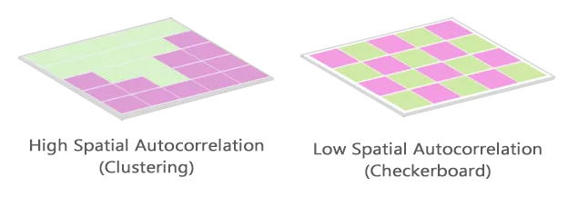
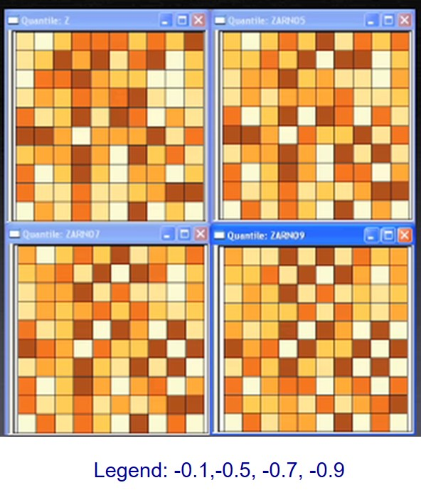
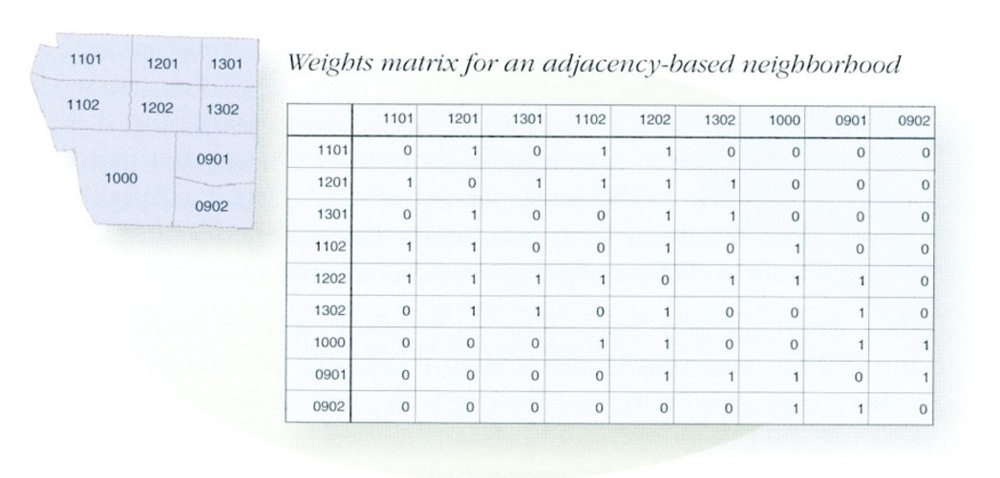
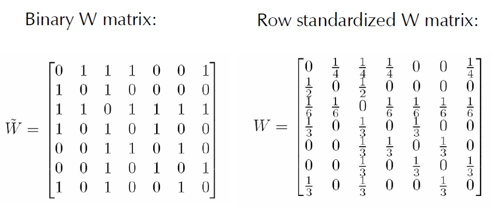

```{r setup, include=FALSE}
knitr::opts_chunk$set(echo = FALSE, 
                      fig.retina = 3, 
                      warning = FALSE, 
                      message = FALSE)
```

# Content

.large[

- The concept of spatial autocorrelation and how it help us to understand real world phenomena
- Defining spatial Neighbourhoods and Weights
- Contiguity-Based Spatial Weights
    - Rook's
    - Queen's
- Distance-Band Spatial Weights
- Applications of Spatial Weights
]

---
## What is geographically referenced attribute?

.large[
A kind of data that is very similar to an ordinary data.  The only difference is that each observation is associated with some form of geography such as numbers of aged population by planning zone.

```{r echo=FALSE, eval=TRUE}
packages = c('ggstatsplot', 'DT', 'sf', 'tmap', 'tidyverse')
for (p in packages){
  if(!require(p, character.only = T)){
    install.packages(p)
  }
  library(p,character.only = T)
}
```

```{r tx-wrangle, highlight.output = 9:13}
geodemog <- readRDS("data/geodemog.RDS")
glimpse(geodemog)
```
]

---
## Describing attribute distribution

The dependency ratio values by planning subzone are normally distributed.

.center[
```{r echo=FALSE, eval=TRUE, fig.width=8, fig.height=6}
gghistostats(data = geodemog, 
             x = DEPENDENCY,
             xlab = "Dependency ratio",
             centrality.parameter = "median",
             normal.curve = TRUE,
             normal.curve.args = list(color = "red", size = 1)
  )

```
]

---
## Geographical distribution question

.large[
Are the planning subzones with high proportion of dependency ratio randomly distributed over space?]

.center[

```{r, echo=FALSE, eval=TRUE, fig.width=15, fig.height=6}

tm_shape(geodemog)+
  tm_fill("DEPENDENCY", 
          style = "quantile", 
          palette = "Blues",
          title = "Dependency ratio") +
  tm_layout(main.title = "Distribution of Dependency Ratio by planning subzone",
            main.title.position = "center",
            main.title.size = 1.2,
            legend.height = 0.45, 
            legend.width = 0.35,
            frame = TRUE) +
  tm_borders(alpha = 0.5) 
```
]

---
## Geographical distribution question

.large[
Are the planning subzones with high proportion of dependency ratio randomly distributed over space?]
.center[

```{r, echo=FALSE, eval=TRUE, fig.width=15, fig.height=6}

tm_shape(geodemog)+
  tm_fill("DEPENDENCY", 
          style = "jenks", 
          palette = "Blues",
          title = "Dependency ratio") +
  tm_layout(main.title = "Distribution of Dependency Ratio by planning subzone",
            main.title.position = "center",
            main.title.size = 1.2,
            legend.height = 0.45, 
            legend.width = 0.35,
            frame = TRUE) +
  tm_borders(alpha = 0.5) 
```
]

---
# Tobler’s First law of Geography

.center[
## Everything is related to everything else,<br/> but near things are more related than distant things.
].

.pull-left[
.large[
The foundation of the fundamental concepts of:

- spatial dependence, and 

- spatial autocorrelation
]]

.pull-right[
]

.small[[Reference: A Computer Movie Simulating Urban Growth in the Detroit Region](http://www.geog.ucsb.edu/~tobler/publications/pdf_docs/A-Computer-Movie.pdf)
]


---
## Spatial Dependency

.pull-left[
.large[
- Spatial dependence is the spatial relationship of variable values (for themes defined over space, such as rainfall) or locations (for themes defined as objects, such as cities). 

- Spatial dependence is measured as the existence of statistical dependence in a collection of random variables, each of which is associated with a different geographical location.
]]

.pull-right[
]

---
## Spatial Autocorrelation

.large[
- Spatial autocorrelation is the term used to describe the presence of systematic spatial variation in a variable. 

- The variable can assume values either: 
    - at any point on a continuous surface (such as land use type or annual precipitation levels in a region); 
    - at a set of fixed sites located within a region (such as prices at a set of retail outlets); or 
    - across a set of areas that subdivide a region (such as the count or proportion of households with two or more cars in a set of Census tracts that divide an urban region).]
    
.center[
]

---
## Positive Spatial Autocorrelation

.pull-left[
.large[
- Clustering
    - like values tend to be in similar locations.

- Neighbours are similar
    - more alike than they would be under spatial randomness.
    
- Compatible with diffusion
    - but not necessary caused by diffusion.
]]

.pull-right[
]

---
## Negative Spatial Autocorrelation

.pull-left[
.large[
- Checkerboard patterns
    - “opposite” of clustering

- Neighbours are dissimilar
    - more dissimilar than they would be under spatial randomness

- Compatible to competition
    - but not necessary competition
]]

.pull-right[
]

---
# What are Spatial Weights *(wij)*

.large[
- A way to define spatial neighbourhood.]

.center[
]

---
## Defining Spatial Weight Matrices

.center[
]

---
## Contiguity Neighbours

.large[
- Contiguity (common boundary)

- What is a “shared” boundary?]

.center[
]

---
### Beyond the basic contiguity neighbours

.large[
There are also second-order, third-order, forth-order, etc contiguity]

.center[
]

---
## Weights matrix: Adjacency-based neighbours

.large[
**Quiz**: With reference to the figure below, list down the neighbour(s) of area 1202 using Rook case]

.center[
]

---
## Weights Matrix: Distance-based neighbours

.large[
**Quiz:** With reference to the figure below, create a weights matrix for d = 650.
]

.center[
]

---
## Weights matrix: Measured distances

.center[
]

---
## Row standardisation

.large[
- Row-standardised weights increase the influence of links from observations with few neighbours, which binary weights vary the influence of observations.
    - Those with many neighbours are up-weighted compared to those with few.]

.center[
]

---
## Spatially Lagged Variables

.large[
With a neighbor structure defined by the non-zero elements of the spatial weights matrix W, a **spatially lagged variable** is a weighted sum or a weighted average of the neighboring values for that variable. In most commonly used notation, the spatial lag of y is then expressed as Wy.

Formally, for observation i, the spatial lag of yi, referred to as [Wy]i (the variable Wy observed for location i) is:] 

.center[
]

.large[where the weights wij consist of the elements of the i-th row of the matrix W, matched up with the corresponding elements of the vector y.
]

---
### Spatially Lagged Variables

.large[
Spatial lag with row-standardized weights]

.center[
]

---
### Spatial window sum

.large[
The spatial window sum uses and includes the diagonal element.]

.center[
]


---
## References

+ Chapter 2. [Codifying the neighbourhood structure](https://www.insee.fr/en/statistiques/fichier/3635545/imet131-f-chapitre-2.pdf) of [Handbook of Spatial Analysis: Theory and Application with R](https://www.insee.fr/en/information/3635545).
+ François Bavaud (2010) ["Models for Spatial Weights: A Systematic Look"](https://onlinelibrary.wiley.com/doi/abs/10.1111/j.1538-4632.1998.tb00394.x) *Geographical Analysis*, Vol. 30, No.2, pp 153-171.
+ Tony H. Grubesic and Andrea L. Rosso (2014) ["The Use of Spatially Lagged Explanatory Variables for Modeling Neighborhood Amenities and Mobility in Older Adults"](https://www-jstor-org.libproxy.smu.edu.sg/stable/26326897?sid=primo&seq=1#metadata_info_tab_contents), *Cityscape*, Vol. 16, No. 2, pp. 205-214.


```{r echo=FALSE, eval=FALSE}
library(pagedown)
pagedown::chrome_print("Topic06-Spatial_Weights.html")
```
