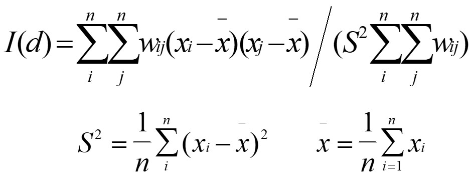
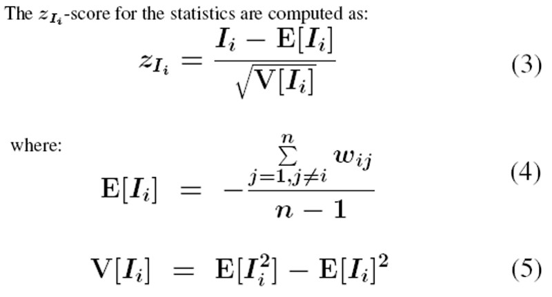
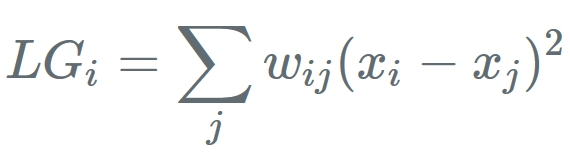
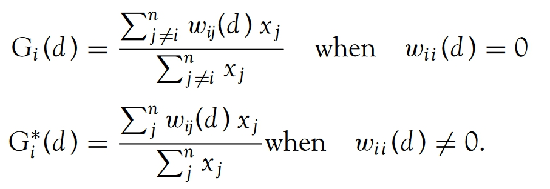

```{r setup, include=FALSE}
knitr::opts_chunk$set(echo = FALSE, 
                      fig.retina = 3, 
                      warning = FALSE, 
                      message = FALSE)
```

## Content
.large[
- What is Spatial Autocorrelation
    - Measures of Global Spatial Autocorrelation
    - Measures of Global High/Low Clustering
- Introducing Localised Geospatial Analysis
    - Local Indicators of Spatial Association (LISA)
- Cluster and Outlier Analysis
    - Local Moran and Local Geary
    - Moran scatterplot
    - LISA Cluster Map
- Hot Spot and Cold Spot Areas Analysis
    - Getis and Ord’s G-statistics
- Case Studies
]

---
## What is Spatial Autocorrelation

.large[
- Toble's First Law of Geography 
- Spatial Dependency
- Spatial Autocorrelation
    - Positive autocorrelation
    - Negative autocorrelation
]

---
### Tobler’s First law of Geography

.center[
### Everything is related to everything else,<br/> but near things are more related than distant things.
].

.pull-left[
.large[
The foundation of the fundamental concepts of:

- spatial dependence, and 

- spatial autocorrelation
]]

.pull-right[
]

.small[[Reference: A Computer Movie Simulating Urban Growth in the Detroit Region](http://www.geog.ucsb.edu/~tobler/publications/pdf_docs/A-Computer-Movie.pdf)
]

---
### Spatial Dependency

.pull-left[
.large[
- Spatial dependence is the spatial relationship of variable values (for themes defined over space, such as rainfall) or locations (for themes defined as objects, such as cities). 

- Spatial dependence is measured as the existence of statistical dependence in a collection of random variables, each of which is associated with a different geographical location.
]]

.pull-right[
]

---
### Spatial Autocorrelation

.large[
- Spatial autocorrelation is the term used to describe the presence of systematic spatial variation in a variable. 

- The variable can assume values either: 
    - at any point on a continuous surface (such as land use type or annual precipitation levels in a region); 
    - at a set of fixed sites located within a region (such as prices at a set of retail outlets); or 
    - across a set of areas that subdivide a region (such as the count or proportion of households with two or more cars in a set of Census tracts that divide an urban region).]
    
.center[
]

---
### Positive Spatial Autocorrelation

.pull-left[
.large[
- Clustering
    - like values tend to be in similar locations.

- Neighbours are similar
    - more alike than they would be under spatial randomness.
    
- Compatible with diffusion
    - but not necessary caused by diffusion.
]]

.pull-right[
]

---
### Negative Spatial Autocorrelation

.pull-left[
.large[
- Checkerboard patterns
    - “opposite” of clustering

- Neighbours are dissimilar
    - more dissimilar than they would be under spatial randomness

- Compatible to competition
    - but not necessary competition
]]

.pull-right[
]

---
##  Measures of Global Spatial Autocorrelation

.vlarge[
- Moran’s I 
- Geary's c
]

---
##  Measures of Global Spatial Autocorrelation: Moran’s I 

.large[Describe how features differ from the values in the study area as a whole
]

.center[
]

.large[
- Moran I (Z value) is:  
    - positive (I>0): Clustered, observations tend to be similar;
    - negative(I<0): Dispersed, observations tend to be dissimilar;
    - approximately zero: observations are arranged randomly over space.] 

---
###  Measures of Global Spatial Autocorrelation: Geary's c 

.large[
- Describing how features differ from their immediate neighbours]

.center[
]

.large[
- Geary c (Z value) is: 
    - Large c value (>1) : Dispersed, observations tend to be dissimilar;
    - Small c value (<1) : Clustered, observations tend to be similar;
    - c = 1: observations are arranged randomly over space. 
]

---
### Relationship of Moran’s I and Geary’s C 

.large[
- C approaches 0 and I approaches 1 when similar values are clustered. 

- C approaches 3 and I approaches -1 when dissimilar values tend to cluster. 
High values of C measures correspond to low values of I. 

- So the two measures are inversely related. 
]

---
### z-score and p-value explained

.pull-left[
.large[
- Statistically, we select the confident interval such as 95% => alpha value = 0.05. 
- Reject the Null hypothesis (H0) if p-value is smaller than alpha value.

- Failed to reject the Null Hypothesis (H0) if p-value is greater than alpha value.
]]

.pull-right[
]

.small[Reference: Confidence Interval or P-Value? https://www.ncbi.nlm.nih.gov/pmc/articles/PMC2689604/]

---
### Spatial Randomness

.large[
The Null Hypothesis:
- Observed spatial pattern of values is equally likely as any other spatial pattern.

- Values at one location do not depend on values at other (neighbouring) locations.

- Under spatial randomness, the location of values may be altered without affecting the information content of the data.] 

---
### What if my data violate the assumptions? 
.large[
- If you doubt that the assumptions of Moran’s I are true (normality and randomization), we can use a Monte Carlo simulation.
    - Simulate Moran’s I n times under the assumption of no spatial pattern,
    
    - Assigning all regions the mean value

    - Calculate Moran’s I,  

- Compare actual value of Moran’s I to randomly simulated distribution to obtain p-value (pseudo significance). 
]

---
##  Measures of Global High/Low Clustering

.vlarge[
- Getis-Ord Global G
]

---
###  Measures of Global High/Low Clustering: Getis-Ord Global G 
.large[
- The G(d)G(d)G(d) statistic is concerned with the overall concentration or lack of concentration in all pairs that are neighbours given the definition of neighbouring areas. 
- The variable must contain only positive values to be used.]

.center[
]

.small[
Source: Getis, A., & Ord, K. (1992). ["The Analysis of Spatial Association by Use of Distance Statistics"](https://onlinelibrary.wiley.com/doi/abs/10.1111/j.1538-4632.1992.tb00261.x). *Geographical Analysis*, 24, 189–206.
]

---
###  Interpretation of Getis-Ord Global G

.large[
- The p-value is not statistically significant.
    - You cannot reject the null hypothesis. It is possible that the spatial distribution of feature attribute values is the result of random spatial processes. Said another way, the observed spatial pattern of values could be one of many possible versions of complete spatial randomness.
- The p-value is **statistically significant**, and the z-score is **positive**.
    - You can reject the null hypothesis. The spatial distribution of high values in the dataset is more spatially clustered than would be expected if underlying spatial processes were truly random.
- The p-value is **statistically significant**, and the z-score is **negative**.
    - You can reject the null hypothesis. The spatial distribution of low values in the dataset is more spatially clustered than would be expected if underlying spatial processes were truly random.
]

---
## Local Spatial Autocorrelation Statistics

.large[
- A collection of geospatial statistical analysis methods for analysing the **location related tendency** (clusters or outliers) in the attributes of **geographically referenced data** (points or areas).

- Can be indecies decomposited from their global measures such as local Moran's I, local Geary's c, and Getis-Ord Gi*.

- These spatial statistics are well suited for:

    - detecting clusters or outliers;
    - identifying hot spot or cold spot areas;
    - assessing the assumptions of stationarity; and
    - identifying distances beyond which no discernible association obtains.
]

---
## Local Indicator of Spatial Association (LISA)

.large[

- A subset of localised geospatial statistics methods.

- Any spatial statistics that satisfies the following two requirements (Anselin, L. 1995):

    - the LISA for each observation gives an indication of the extent of significant spatial clustering of similar values around that observation;
    
    - the sum of LISAs for all observations is proportional to a global indicator of spatial association.
]

---
## Detecting Spatial Clusters and Outliers
.large[
- Given a set of geospatial features (i.e. points or polygons) and an analysis field, the spatial statistics identify **spatial clusters** of features with high or low values.  The tool also identifies **spatial outliers**.

- local Moran's I is the most popular spatial statistical method used, other methods include local Geary's c. 

- In general, the analysis will calculate a local statistic value, a z-score, a pseudo p-value, and a code representing the cluster type for each statistically significant feature. The z-scores and pseudo p-values represent the statistical significance of the computed index values.
]
.center[
]

---
## Local Moran's I 

.large[Given a geographically referenced attribute field, X the formula of local Moran's I is:]
.center[
]

---
### Local Moran and Moran’s I

.large[
- The summation of local Moran is
]
.center[
]

.large[
- Moran’s I
]
.center[
]

---
### Test statistics of Local Moran

.center[
]

---
### Interpretation of Local Moran

.large[
- An **outlier**: significant and negative if location i is associated with relatively low values in  surrounding locations.

- A **cluster**: significant and positive if location i is associated with relatively high values of the surrounding locations.

- In either instance, the p-value for the feature must be small enough for the cluster or outlier to be considered statistically significant.

- The commonly used alpha-values are 0.1, 0.05, 0.01, 0.001 corresponding the 90%, 95, 99% and 99.9% confidence intervals respectively.] 

---
### Interpretation of Local Moran and Scatterplot

.center[
]

---
## Other forms of LISA

- Local Geary

.center[
]


---
## Detecting hot and cold spot areas
.large[
- Given a set of geospatial features (i.e. points or polygons) and an analysis field, the spatial statistics tell you where features with either high (i.e. hot spots) or low values (cold spots) cluster spatially. 
- The spatial statistic used is called Getis-Ord Gi* statistic (pronounced G-i-star). 
- Getis and Ord (1992) define the local G and G∗ statistics for region i (i=1,···,n) as]

.center[
]

---
### Getis-Ord Gi* 

.large[For variable x to be nonpositive and the weight matrix W(d) to be nonbinary the G and G* statistics are defined as]

.center[
]

---
### Interpretation of Getis-Ord Gi and Gi*

.large[
- A hot spot area: significant and positive if location i is associated with relatively high values of the surrounding locations.

- A cold spot area: significant and negative if location i is associated with relatively low values in surrounding locations.]

---
## Fixed weighting scheme

.pull-left[
Things to consider if fixed distance is used:
- All features should have at least one neighbour.

- No feature should have all other features as neighbours.

- Especially if the values for the input field are skewed, you want features to have about eight neighbors each. 

- Might produce large estimate variances where data are sparse, while mask subtle local variations where data are dense.

- In extreme condition, fixed schemes might not be able to calibrate in local areas where data are too sparse to satisfy the calibration requirements (observations must be more than parameters).
]

.pull-right[
]

---
## Adaptive weighting schemes

.pull-left[
.large[
- Adaptive schemes adjust itself according to the density of data

    - Shorter bandwidths where data are dense and longer where sparse.

    - Finding nearest neighbors are one of the often used approaches.
]]

.pull-right[
]

---
## Best practice guidelines

- Results are only reliable if the input feature class contains at least 30 features.

- The input field mst be in continuous data type such as a count, rate, or other numeric measurement, no categorical attribute field is allowed.

---
## Best practice guidelines
### Select an appropriate spatial weighting method 

.large[
- The **polygon contiguity** method is effective when polygons are similar in size and distribution, and when spatial relationships are a function of polygon proximity (the idea that if two polygons share a boundary, spatial interaction between them increases). 
    - When you select a polygon contiguity conceptualization, you will almost always want to select row standardization for tools that have the Row Standardization parameter.

- The **fixed distance** method works well for point data. It is often a good option for polygon data when there is a large variation in polygon size (very large polygons at the edge of the study area and very small polygons at the center of the study area, for example), and you want to ensure a consistent scale of analysis.]

---
## Best practice guidelines
### Select an appropriate spatial weighting method 
.large[
- The **inverse distance** method is most appropriate with continuous data or to model processes where the closer two features are in space, the more likely they are to interact/influence each other.
    - Be warned that with this method, every feature is potentially a neighbour of every other feature, and with large datasets, the number of computations involved will be enormous. 
]

---
## Best practice guidelines
### Select an appropriate spatial weighting method

.large[
- The **k-nearest neighbours** method is effective when you want to ensure you have a minimum number of neighbors for your analysis. 
    - Especially when the values associated with your features are skewed (are not normally distributed), it is important that each feature is evaluated within the context of at least eight or so neighbors (this is a rule of thumb only). 
    
    - When the distribution of your data varies across your study area so that some features are far away from all other features, this method works well.
    
    - Note, however, that the spatial context of your analysis changes depending on variations in the sparsity/density of your features. 
    
    - When fixing the scale of analysis is less important than fixing the number of neighbors, the k-nearest neighbours method is appropriate.
]

---
### Futher guide on selecting a fixed-distance band value

.large[
- Select a distance based on what you know about the geographic extent of the spatial processes promoting clustering for the phenomena you are studying.

- Use a distance band that is large enough to ensure all features will have at least one neighbor, or results will not be valid. 

- Try not to get stuck on the idea that there is only one correct distance band. Reality is never that simple. Most likely, there are multiple/interacting spatial processes promoting observed clustering.  

- Select an appropriate distance band or threshold distance.
    - All features should have at least one neighbour.
    - No feature should have all other features as a neighbour.
    - Especially if the values for the input field are skewed, each feature should have about eight neighbours.
]

---
## In colclusion

.large[
Spatial statistics methods are not a blackbox.  Before performing the analysis, a geospatial analyst should consider the followings:

- What is the **geographical** question?

- What is the **geospatial feature**?

- What is the **analysis field**?

- Which **conceptualization of spatial relationships** is appropriate? 
]
  
---
## Case Study 1: Area-based 
.center[
]

.small[Reference: https://ink.library.smu.edu.sg/sis_research/4331/]

---
### Objectives
.large[
- Using micro-level event data of armed conflicts in Africa, this study aims to show how a data-driven geospatial analytics approach can be used reveal useful spatio-temporal pattern of the conflict events,

- Demonstrating how a reproducible research can be conducted  by using R Markdown, Rstudio and other appropriate R packages, and

- Sharing the findings and more importantly, the approaches we used to the practice political researchers so that they are confident to conduct similar studies by themselves. 
]

---
### Violence against civilians in Africa, 1997-2017

.center[
]
]

---
### LISA Cluster Map for Phase I - from 1997 to 2003

.center[
]

---
### LISA Cluster Map Phase II - from 2004 to 2010

.center[
]

---
### LISA Cluster Map Phase III - from 2011 to 2017

.center[
]

---
## Case Study 2: Point-based 
.center[
]

.small[Reference: https://ink.library.smu.edu.sg/sis_research/4376/]

---
### Objectives

.large[
This project aims to contribute new knowledge towards the study of electricity consumption and its analyses in two ways. 

- Firstly, we will analyze electricity consumption using mainly two spatial analysis methods, Local Indicators of Spatial Association (LISA) and Geographically-Weighted Principal Components Analysis (GWPCA) to discover spatial patterns on electricity consumption patterns.

- Secondly, this project aims to be a proof-of-concept of using R to achieve an end-to-end analytics solution, from data cleaning and preparation all the way to visualization of results. The visualizations should not only present the analysis results in a clear manner but also prompt users to do their own exploration of electricity consumption in Singapore and derive insights that fit their purpose.
]

---
### Exploratory Data Analysis

.large[
Boxplots are used to reveal the statistical distributions of electricity consumption by dwelling types.]

.center[
]

---
### LISA Map of average electricity consumptions: At the national level

.center[
]

---
### LISA Map of average electricity consumptions: At the planning area level

.center[
]

---
### LISA Map of average electricity consumptions: At the local level

.center[
]

---
## References

.large[
- Moran, P. A. P. (1950). ["Notes on Continuous Stochastic Phenomena"](https://www-jstor-org.libproxy.smu.edu.sg/stable/2332142?seq=1#metadata_info_tab_contents). Biometrika. 37 (1): 17–23.
- Geary, R.C. (1954) ["The Contiguity Ratio and Statistical Mapping"](https://www-jstor-org.libproxy.smu.edu.sg/stable/2986645?sid=primo&origin=crossref&seq=1#metadata_info_tab_contents). *The Incorporated Statistician*, Vol. 5, No. 3, pp. 115-127. 
- [Moran's I](https://en.wikipedia.org/wiki/Moran%27s_I)
- [Geary's c](https://en.wikipedia.org/wiki/Geary%27s_C)
- Getis, A., & Ord, K. (1992). ["The Analysis of Spatial Association by Use of Distance Statistics"](https://onlinelibrary.wiley.com/doi/abs/10.1111/j.1538-4632.1992.tb00261.x). *Geographical Analysis*, 24, 189–206.
- Anselin, L. (1995). "Local indicators of spatial association – LISA". *Geographical Analysis*, 27(4): 93-115. 
- Getis, A. and Ord, J.K. (1992) “The analysis of spatial association by use of distance statistics”. *Geographical Analysis*, 24(3): 189-206.
- Ord, J.K. and Getis, A. (2010) “Local spatial autocorrelation statistics: Distributional issues and an application”. *Geographical Analysis*, 27(4): 286-306.
]

```{r echo=FALSE, eval=FALSE}
library(pagedown)
pagedown::chrome_print("Lesson07-SpaAuto.html")
```