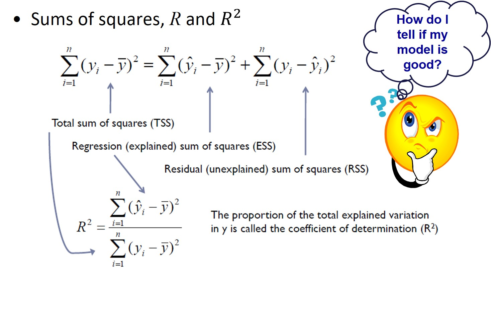
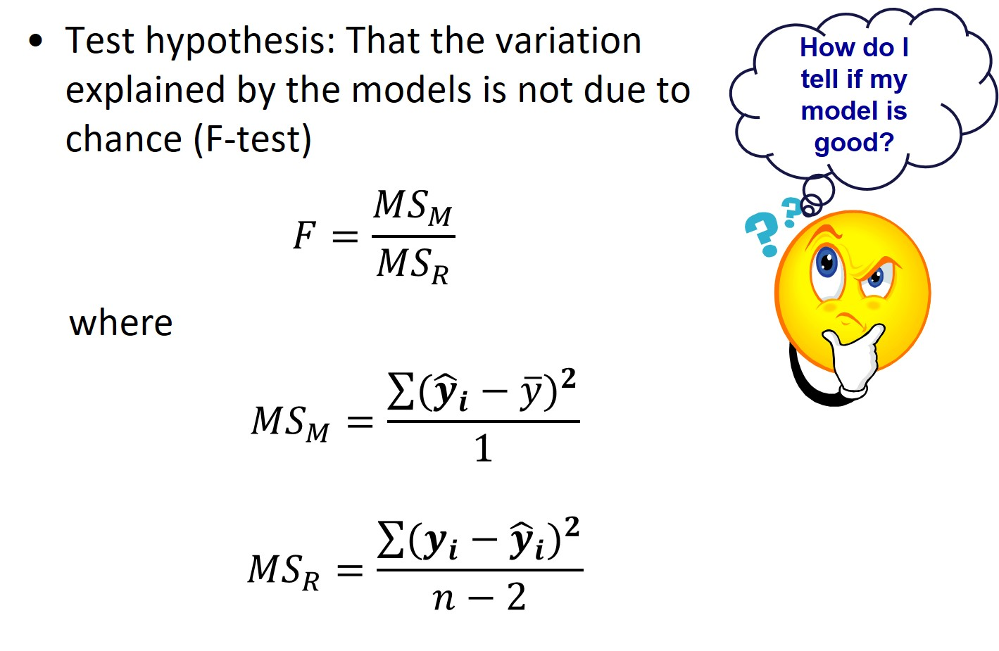
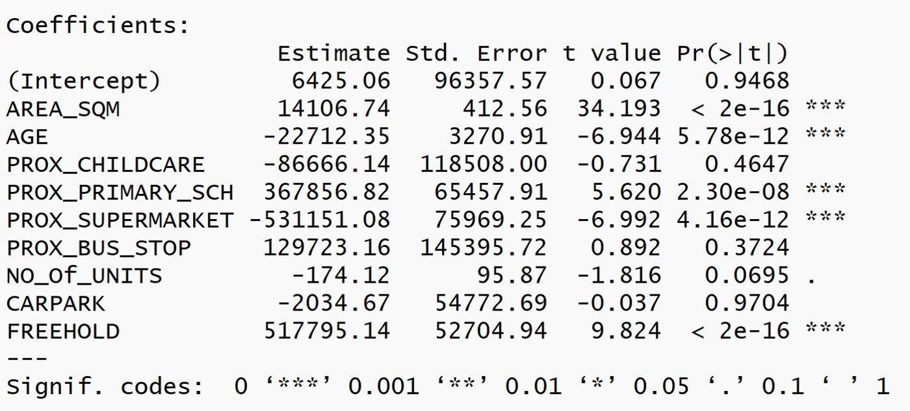
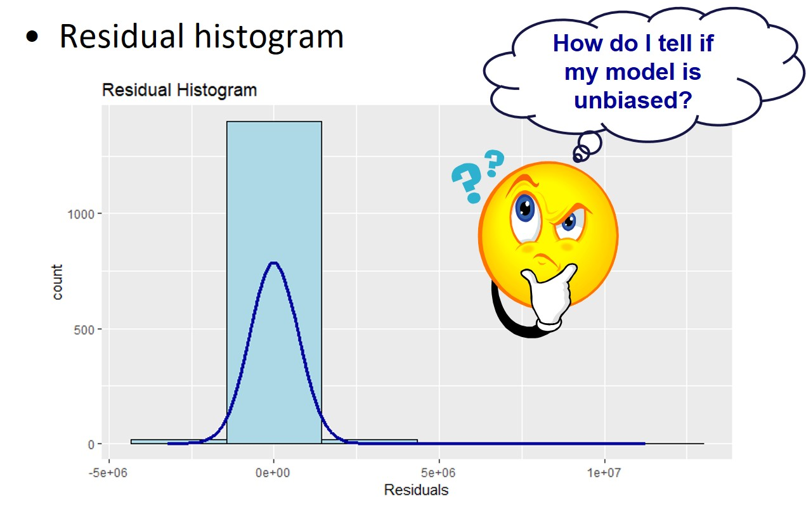

```{r setup, include=FALSE}
knitr::opts_chunk$set(echo = FALSE, fig.retina = 3, warning = FALSE, message = FALSE)
```

```{r xaringan-themer, include=FALSE, warning=FALSE}
library(xaringanthemer)
style_duo_accent(
  primary_color = "#1381B0",
  secondary_color = "#FF961C",
  inverse_header_color = "#FFFFFF"
)
```

# Content
.large[
- Introducing Regression Modelling
    - Simple Linear Regression
    - Multiple Linear Regression

- What is Spatial Non-stationary

- Introducing Geographically Weighted Regression
    - Weighting functions (kernel)
    - Weighting schemes
    - Bandwidth

- Interpreting and Visualising
]

---
# The WHY Questions

.large[
- Why some condominium units were transacted at relatively higher prices than others?]

.center[
]

---
# The WHY Questions

.large[
Why condominium units located at the central part of Singapore were transacted at relatively higher prices than others?]

.center[
]

---
# What is regression analysis?

.large[
- A set of statistical processes for explaining the relationships among variables.

- The focus is on the relationship between a dependent variable (y) and one or more independent variables (x)
    - Does X affect Y? If so, how?
    - What is the change in Y given a one unit change in X?

- Estimate outcomes based on the relationships modelled.]

---
## A Simple Linear Regression Model

.large[
The formula]

.center[
]

---
### The Least Squares Method

.large[
- The sum of the vertical deviations (y axis) of the points from the line is minimal]

.center[
]

---
## Multiple Linear Regression


---
### Assessing the goodness of fit



---
### Significance testing in regression



---
### Goodness of fit test


---
### Assessing individual parameters



---
### Are there redundant explanatory variables?


---
### Individual parameter testing


---
## Assumptions of linear regression models

.large[
- **Linearity assumption**. The relationship between the dependent variable and independent variables is (approximately) linear.

- **Normality assumption**. The residual errors are assumed to be normally distributed.

- **Homogeneity of residuals variance**. The residuals are assumed to have a constant variance (homoscedasticity). 
- The residuals are uncorrelated with each other.
    - serial correlation, as with time series
- (Optional) The errors (residuals) are normally distributed and have a 0 population mean.] 

---
### The linearity assumption


---
### The linearity assumption

Residuals vs Fitted plot
- Used to check the linear relationship assumptions. A horizontal line, without distinct patterns is an indication for a linear relationship, what is good.


---
### Demystifying the linearity assumption myth 

.pull-left[

.large[
The myth:
- We should transform the values of the y variable when they are large.]

```{r}
library(tidyverse)
library(sjPlot)
library(sjmisc)
library(sjlabelled)
library(olsrr)
data1 <- read_delim("data/ex1_data.txt", delim=";")
data1.lm <- lm(formula=y ~ x, data = data1)
tab_model(data1.lm)
```
]

.pull-right[
```{r}
ggplot(data=data1,  
       aes(x=`x`, y=`y`)) +
  geom_point() +
  geom_smooth(method = lm)
```
]

---
### The linearity assumption

.pull-left[
.large[
Despite the values of the dependent variable is rather similar to the values of the independent variable, the diagnostic plot shows that the linearity assumption has been violated.
]]

.pull-right[
```{r}
ols_plot_obs_fit(data1.lm, print_plot = TRUE)
```
]

---
### Data transformation come to rescue

.pull-left[
```{r}
data.lm2 <- lm(formula=y ~ exp(x), data = data1)
tab_model(data.lm2)
```
]

.pull-right[
```{r}
ggplot(data=data1,  
       aes(x=exp(x), y=`y`)) +
  geom_point() +
  geom_smooth(method = lm)
```
]

---
### The linearity assumption

.pull-left[
.large[
The diagnostic plot on the right shows that the linearity assumption has been conformed.
]]

.pull-right[
```{r}
ols_plot_obs_fit(data.lm2, print_plot = TRUE)
```
]

---
### The normality assumption

.large[
**Warning**: This is the test on the residual and not on the dependent variable.]



---
### Checking for serial correlation


---
# Spatial Non-stationary

.large[
- When applied to spatial data, as can be seen, it assumes a stationary spatial process
    - The same stimulus provokes the same response in all parts of the study region.
    - Highly untenable for spatial process
]

---
## Why do relationships vary spatially?

.large[
- Sampling variation
    - Nuisance variation, not real spatial non-stationarity

- Relationships intrinsically different across space
    - Real spatial non-stationarity

- Model misspecification
    - Can significant local variations be removed?
]

---
## Some definitions

.large[
- Spatial non-stationarity: the same stimulus provokes a different response in different parts of the study region.

- Global models: statements about processes which are assumed to be stationary and as such are *location independent*. 

- Local models: spatial decompositions of global models, the results of local models are *location dependent* – a characteristic we usually anticipate from geographic (spatial) data.]


---
## Spatial Autocorrelation assumption

.large[
The **residuals** are assumed to be distributed at random over geographical space.]

.center[
]

---
### Test of spatial autocorrelation 

.large[
To test if the relationships in the model are **non-stationary**. 
- *lm.morantest()* of spdep package will be used.]


---
# Geographically Weighted Regression (GWR)

.large[
- Local statistical technique to analyze spatial variations in relationships.

- Spatial non-stationarity is assumed and will be tested.

- Based on the “First Law of Geography”: everything is related with everything else, but closer things are more related.
]

---
## Geographically Weighted Regression (GWR): The method


---
## Calibration of GWR

.large[
- Local weighted least squares
    - Weights are attached with locations
    - Based on the “First Law of Geography”: everything is related with everything else, but closer things are more related than remote ones
]

---
## Calibration - Weighting functions

.center[
]

---
### Calibration - Weighting functions

.center[
]

---
### Calibration - Weighting schemes

.large[
- Determines weights
    - Most schemes tend to be Gaussian or Gaussian-like reflecting the type of dependency found in most spatial processes.
    - It can be either **Fixed** or **Adaptive**.]
    
.pull-left[
]
    

.pull-right[
]

---
### Calibration - Determining Bandwidth


---
### GWR Report

.large[
- Package Model

- Results of Global Regression

- Results of Geographically Weighted Regression

- SDF: A SpatialPointDataFrame
]

---
## gwr: local R2

.center[
]

---
## gwr: intercept

.center[
]

---
# References

Brunsdon, C., Fotheringham, A.S., and Charlton, M. (2002) [“Geographically weighted regression: A method for exploring spatial nonstationarity”](https://onlinelibrary.wiley.com/doi/abs/10.1111/j.1538-4632.1996.tb00936.x). *Geographical Analysis*, 28: 281-289. 

Brunsdon, C., Fotheringham, A.S. and  Charlton, M., (1999) [“Some Notes on Parametric Significance Tests for Geographically Weighted Regression”](https://onlinelibrary-wiley-com.libproxy.smu.edu.sg/doi/abs/10.1111/0022-4146.00146. *Journal of Regional Science*, 39(3), 497-524.

Mennis, Jeremy (2006) ["Mapping the Results of Geographically Weighted Regression"](https://web-b-ebscohost-com.libproxy.smu.edu.sg/ehost/pdfviewer/pdfviewer?vid=1&sid=2bc1df3b-6c17-46af-8650-2781032f1d91%40pdc-v-sessmgr04), *The Cartographic Journal*, Vol.43 (2), p.171-179.

Stephen A. Matthews ; Tse-Chuan Yang (2012) ["Mapping the results of local statistics: Using geographically weighted regression"](https://www.demographic-research.org/volumes/vol26/6/), *Demographic Research*, Vol.26, p.151-166.


```{r echo=FALSE, eval=FALSE}
library(pagedown)
pagedown::chrome_print("Lesson09-gwr.html")
```