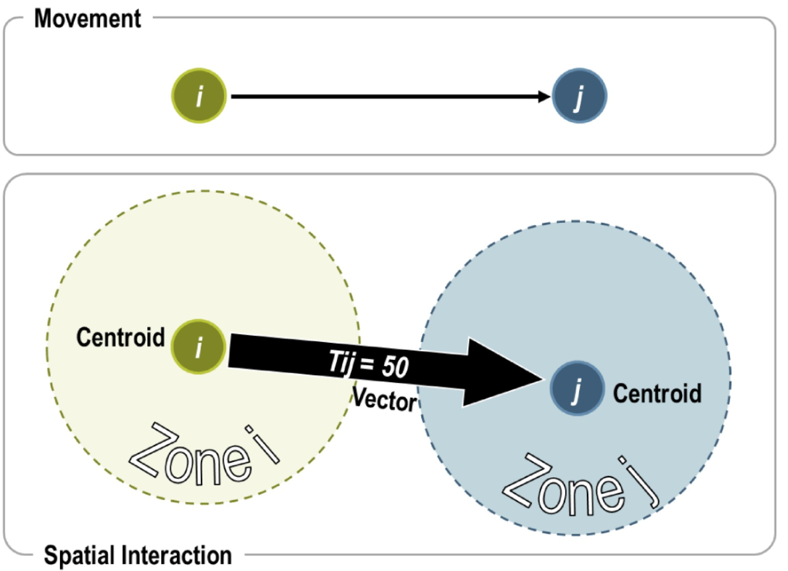

```{r setup, include=FALSE}
knitr::opts_chunk$set(echo = FALSE, fig.retina = 3, warning = FALSE, message = FALSE)
```

```{r xaringan-themer, include=FALSE, warning=FALSE}
library(xaringanthemer)
style_duo_accent(
  primary_color = "#1381B0",
  secondary_color = "#FF961C",
  inverse_header_color = "#FFFFFF"
)
```

# Content

.vlarge[
+ Characteristics of Spatial Interaction Data
+ Spatial Interaction Models
  + Unconstrained 
  + Origin constrined
  + Destination constrained
  + Doubly constrained
]


---
##  What Spatial Interaction Models are? 

.center[
### Spatial interaction or “gravity models” estimate the flow of people, material, or information between locations in geographical space.


]


???
+ Spatial interaction models seek to explain existing spatial flows. As such it is possible to measure flows and predict the consequences of changes in the conditions generating them. When such attributes are known, it is possible to better allocate transport resources such as conveyances, infrastructure, and terminals.

---
### Conditions for Spatial Flows

.vlarge[
+ Three interdependent conditions are necessary for a spatial interaction to occur:
]

.center[

]

???
+ **Complementarity**. There must be a supply and a demand between the interacting locations. A residential zone is complementary to an employment zone because the first is supplying workers while the second is supplying jobs. The same can be said concerning the complementarity between a store and its customers and between an industry and its suppliers (movements of freight). An economic system is based on a large array of complementary activities.
+ **Intervening opportunity (lack of)**. Refers to a location that may offer a better alternative as a point of origin or as a point of destination. For instance, in order to have an interaction of a customer to a store, there must not be a closer store that offers a similar array of goods. Otherwise, the customer will likely patronize the closer store and the initial interaction will not take place.
+ **Transferability**. Mobility must be supported by transport infrastructures, implying that the origin and the destination must be linked. Costs to overcome distance must not be higher than the benefits of the related interaction, even if there are complementarity and no alternative opportunity.

---
## Representation of a Movement as a Spatial Interaction

.pull-left[
.large[
Representing mobility as a spatial interaction involves several considerations:

+ Locations. A movement is occurring between a location of origin and a location of destination. i generally denotes an origin while j is a destination.
+ Centroid. An abstraction of the attributes of a zone at a point. 
+ Flows. Flows are generally expressed by a valued vector Tij representing an interaction between locations i and j.
+ Vectors. A vector Tij links two centroids and has a value assigned to it (50) which can represents movements.
]]

.pull-right[

]


???
+ Locations. A movement is occurring between a location of origin and a location of destination. i generally denotes an origin while j is a destination. The representation of origins and destinations commonly involves centroids.
+ Centroid. An abstraction of the attributes of a zone at a point. This is of particular relevance when the attributes generating mobility are zonal (e.g. ZIP codes, cities, states, etc.) while the graphic representation requires specific origins and destinations. For instance, showing flows between ZIP codes would implicitly require the generation of one centroid for each ZIP code.
+ Flows. Flows are generally expressed by a valued vector Tij representing an interaction between locations i and j.
+ Vectors. On the above figure, two areas, zone i and zone j, are represented as two centroids, i and j. A vector Tij links two centroids and has a value assigned to it (50) which can represents movements such as tons of freight, numbers of passengers per day, or number of phone calls.


---
## Constructing an O/D Matrix

+ The construction of an origin / destination matrix requires directional flow information between a series of locations. 
+ Figure below represents movements (O/D pairs) between five locations (A, B, C, D and E). From this graph, an O/D matrix can be built where each O/D pair becomes a cell. A value of 0 is assigned for each O/D pair that does not have an observed flow.

.center[

]

---
## Three Basic Types of Interaction Models

+ The general formulation of the spatial interaction model is stated as **Tij**, which is the interaction between location i (origin) and location j (destination).  **Vi** are the attributes of the location of origin i, **Wj** are the attributes of the location of destination j, and **Sij** are the attributes of separation between the location of origin i and the location of destination j. 
+ From this general formulation, three basic types of interaction models can be derived:

.center[

]

---
## Gravity Models


```{r echo=FALSE, eval=FALSE}
library(pagedown)
pagedown::chrome_print("Lesson10-SIM.html")
```